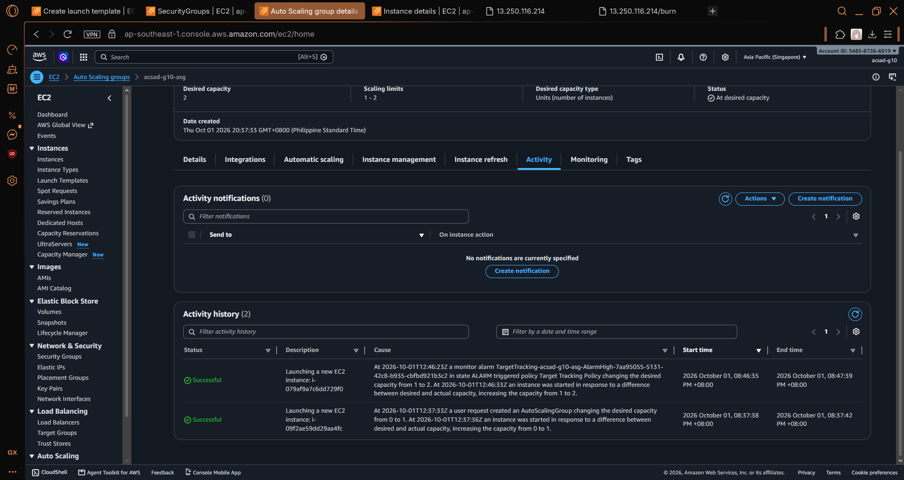
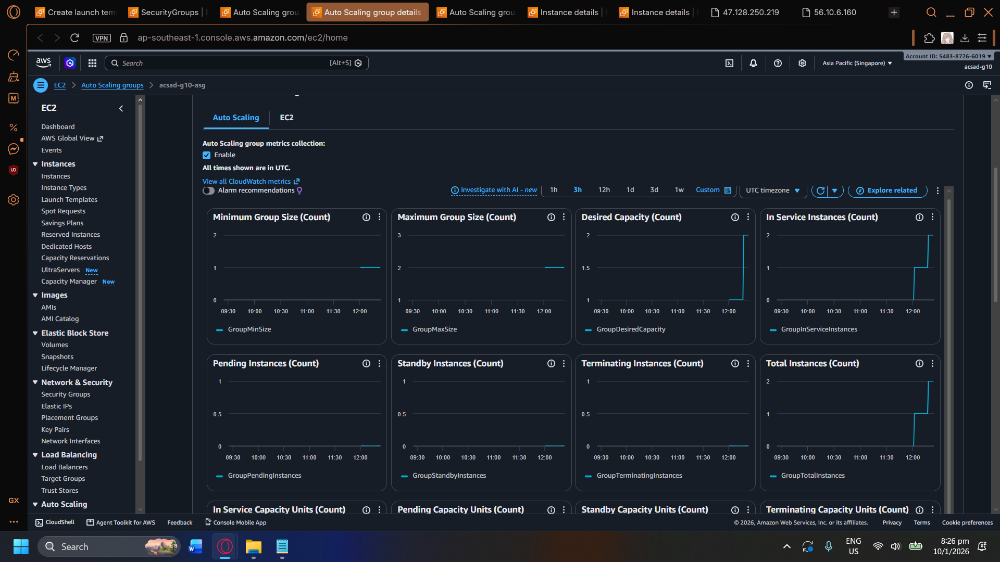

# Lab 2 Submission

Group 10
Talattad, Kwin Gabrille M.
Miranda, Jhon Jellar
Santiago, John Carlo
Sipin, John Cedric

## Instance Tracking
**First Instance**
- Instance ID: i-09f2ae59dd29aa4fc
- Availability Zone: ap-southeast-1b

**Second Instance**
- Instance ID: i-079af9a7c6dd729f0
- Availability Zone: ap-southeast-1a

## Proof (Screenshots)
1. **Activity History:** Add a screenshot showing the Auto Scaling group's Activity history when the second instance launched.
   
   5.3. Open the Activity tab. Wait for a line that says a new instance is launching. Expect this in three to six minutes. Take a screenshot of this Activity History as proof.
   

2. **CloudWatch Alarm:** Add a screenshot of the target tracking alarm in the "In alarm" state.

   5.7. Open the Monitoring tab of the group and look at the CPU chart. Take a screenshot of the CloudWatch Alarm or the CPU utilization chart as proof.
   

## Questions
1. Why did the group stop at 2 instances?
   - The Auto Scaling Group stopped at 2 instances because the desired capacity and scaling policy only required one additional instance to handle the increased CPU utilization. Once the target CPU utilization was reached, no further scale-out was triggered.
2. Why did terminating an instance by hand not remove the cost?
   - Terminating an instance manually did not remove the cost because the Auto Scaling Group automatically replaced the terminated instance to maintain the desired capacity. A new EC2 instance was launched, so resources were still being used.
3. Why is the target value set to your assigned value (e.g., 30-85 percent) instead of 99 percent?
   - The target value is set lower than 99 percent to allow the Auto Scaling Group to respond before the server becomes overloaded. A lower CPU target provides enough time to launch additional instances and maintain performance.
4. What did the automatic cutoff protect us from?
   - The automatic cutoff protected the system from excessive resource usage and unnecessary costs by preventing uncontrolled scaling or keeping instances running beyond the required capacity.
5. What changes when a load balancer sits in front of the group?
   - When a load balancer is added, incoming traffic is distributed across multiple EC2 instances instead of being sent to only one server. This improves availability, reliability, and allows the Auto Scaling Group to handle more users.
