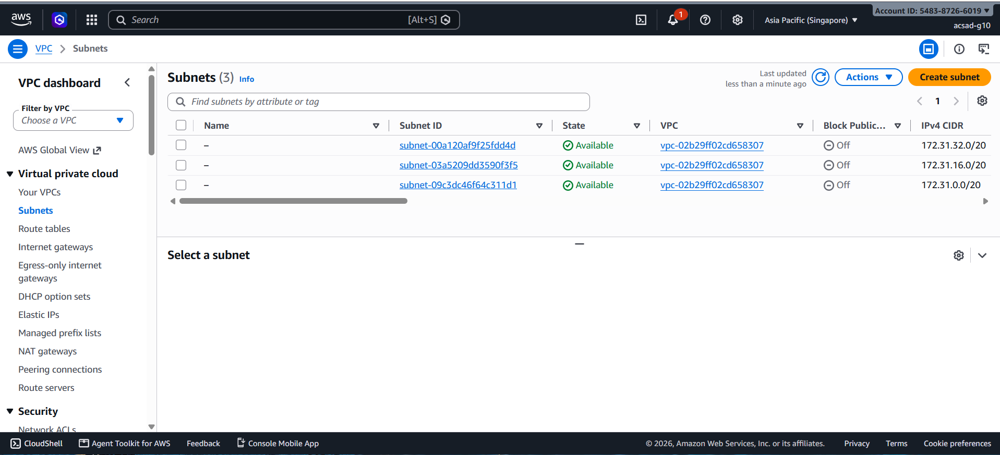
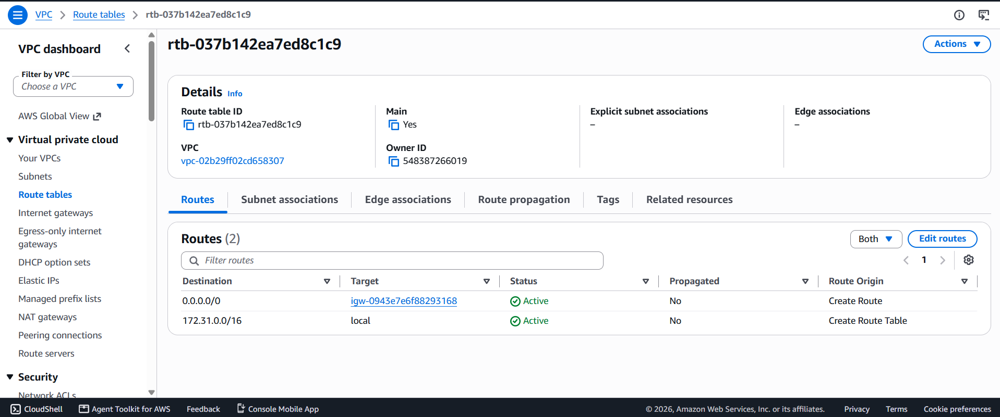
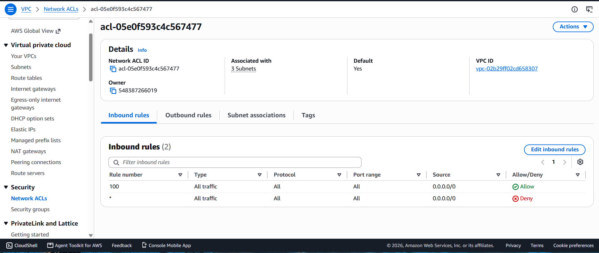
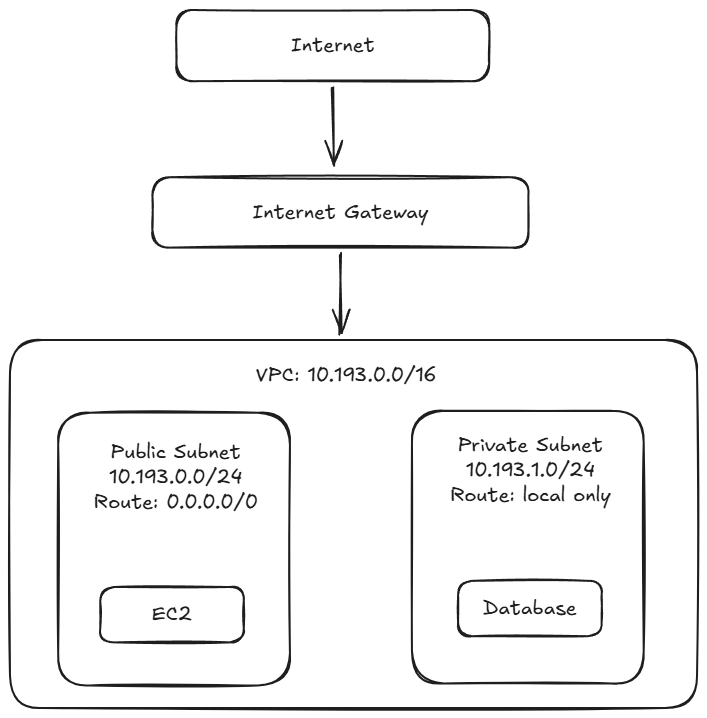

## About me

- GitHub username: Kwin-Talattad
- Section: IV-ACSAD
- IAM user name that I signed in with: acsad-g10
- X: 193

---

## Part A. Explore

### A1. The VPC

Default VPC IPv4 CIDR:

`172.31.0.0/16`

Number of addresses in that CIDR:

65,536

### A2. The subnets

| Availability Zone | IPv4 CIDR |
| --- | --- |
| `ap-southeast-1a` | `172.31.32.0/20` |
| `ap-southeast-1b` | `172.31.16.0/20` |
| `ap-southeast-1c` | `172.31.0.0/20` |

### A3. Available addresses

Available IPv4 addresses in each subnet:

`ap-southeast-1a` 4,090, `ap-southeast-1b` 4,091, `ap-southeast-1c` 4,091.

Why is the number lower than 4,096?

A `/20` has 4,096 addresses. AWS reserves 5 addresses in every subnet. An empty `/20` subnet therefore has 4,091 available addresses.

What uses the missing address in the subnet with the lowest number?

The `ap-southeast-1a` subnet has 4,090 available addresses because an EC2 instance is using one additional IPv4 address through a network interface. The network interface has the address `172.31.37.42`.

### A4. The route table

| Destination | Target |
| --- | --- |
| `172.31.0.0/16` | `local` |
| `0.0.0.0/0` | `igw-0943e7e6f88293168` |

### A5. Public or private

The default subnets are public. The route `0.0.0.0/0` sends traffic to the internet gateway `igw-0943e7e6f88293168`.

### A6. The internet gateway

State of the internet gateway:

Attached

What happens to the default subnets if the gateway is detached?

The `0.0.0.0/0` route would no longer have a working internet gateway target. The subnets would lose their path to the internet. The local route would still allow communication between resources inside the VPC.

### A7. NAT gateways

Number of NAT gateways:

0

Can a server in a new private subnet download updates? Why?

Not yet. The class VPC has no NAT gateway. A private subnet would need a route to a NAT gateway for a server to start connections to the internet.

### A8. The network ACL

| Rule number | Source | Allow or Deny |
| --- | --- | --- |
| 100 | `0.0.0.0/0` | Allow |
| `*` | `0.0.0.0/0` | Deny |

How is a network ACL different from a security group?

A network ACL protects a whole subnet, while a security group protects a resource such as an EC2 instance. A network ACL can have both allow and deny rules and is stateless. A security group has allow rules only and is stateful.

### A9. The default security group

Inbound rule (type and source):

All traffic, from `sg-0c5b6d4081cf0a534`.

Which resources can send traffic to an instance that uses it?

Resources that also use the default security group can send inbound traffic to the instance through this rule.

---

## Part B. Prepare

### B1. Plan two subnets

- Public subnet CIDR: `10.193.0.0/24`
- Private subnet CIDR: `10.193.1.0/24`

### B2. Route tables

Route table of the public subnet:

| Destination | Target |
| --- | --- |
| `10.193.0.0/16` | `local` |
| `0.0.0.0/0` | internet gateway |

Route table of the private subnet:

| Destination | Target |
| --- | --- |
| `10.193.0.0/16` | `local` |

### B3. My VPC diagram

Tool used (Excalidraw, draw.io, Lucidchart, or paper):

Excalidraw

### B4. Predict a change

Can you still open the web page from your laptop? Why?

No. The instance would no longer have a route from the public subnet to the internet gateway. A public IP address alone is not enough if the route to the internet is missing.

Can the instance still reach another instance in the VPC? Why?

Yes. The local route for `10.193.0.0/16` remains in the route table. This route allows communication between resources in the VPC.

### B5. Place a database

Which subnet gets the database? Why?

The private subnet, `10.193.1.0/24`. It does not have a route to the internet gateway, so the database is not directly reachable from the internet.

### B6. My question about VPCs

What is your question, and what made you think of it?

Can a private subnet communicate with another VPC, and what would need to be configured to allow that communication? I thought of this because a VPC is a private network, so I wanted to know how separate VPC networks can communicate with each other.
